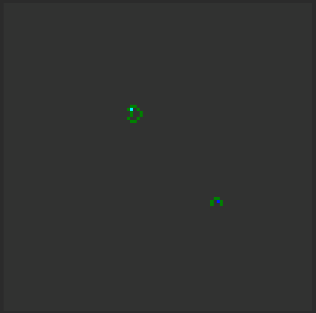

# Langtons-Ant :ant:
An implementation of [Langton’s Ant](https://en.wikipedia.org/wiki/Langton%27s_ant) Cellular Automaton in Unity.  

Langton’s Ant is a two-dimensional universal Turing machine with a very simple set of rules but complex emergent behavior. It was invented by Chris Langton in 1986.

* At an unfilled square, turn 90° right, flip the color of the square, move forward one unit
* At a filled square, turn 90° left, flip the color of the square, move forward one unit

## Preview :eyes:
  
A single instance of Langtons Ant created in Unity at runtime.

## Getting Started :page_with_curl:
Clone or download this repository and open the project with your favourite flavour of Unity.  
_This project was built with Unity 2018.2_

## Optimizations :pencil2:
There are a few points to consider when using this application:
* The gameboard is created up of quads defined by the board size (width * height). Creating thousands of objects will cause substantial slow downs.

* Currently cleaning up unsed quads out the array is not supported.

## Contributing :muscle:
Looking to contribute something to this project? **Here's how you can help.**  
If you believe something needs to be immediately fixed please open an issue and document the problem. Fork this project and create a pull request with your solution to the problem. Thank you.
